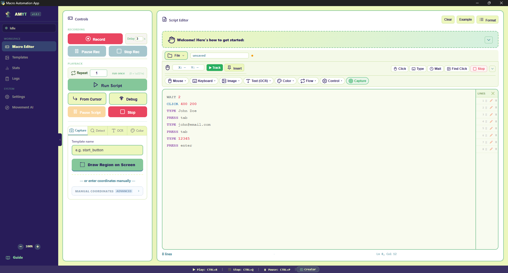
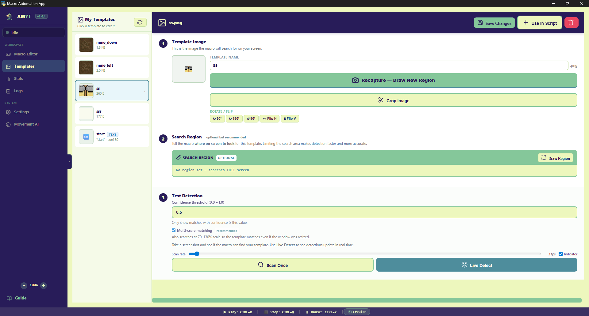
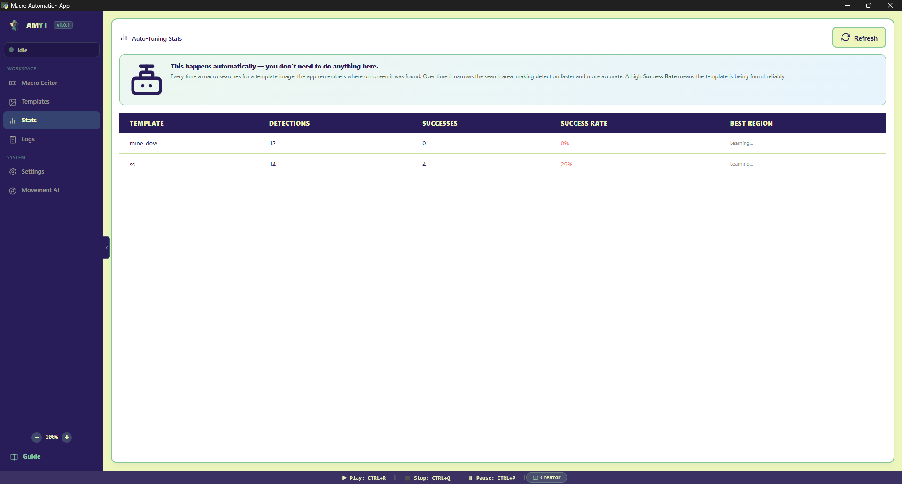
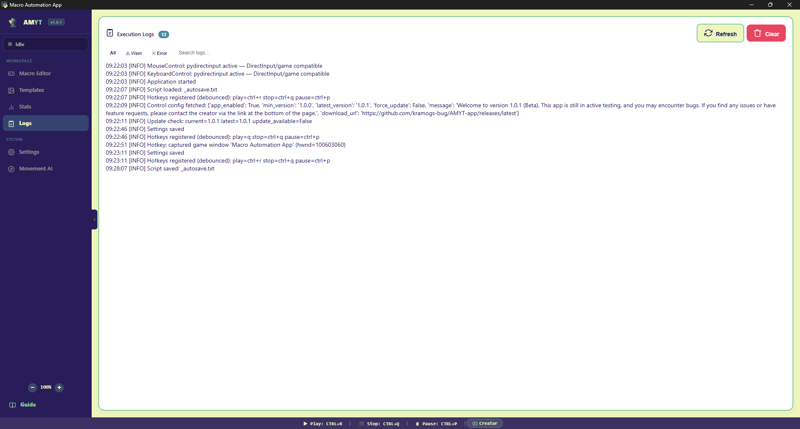
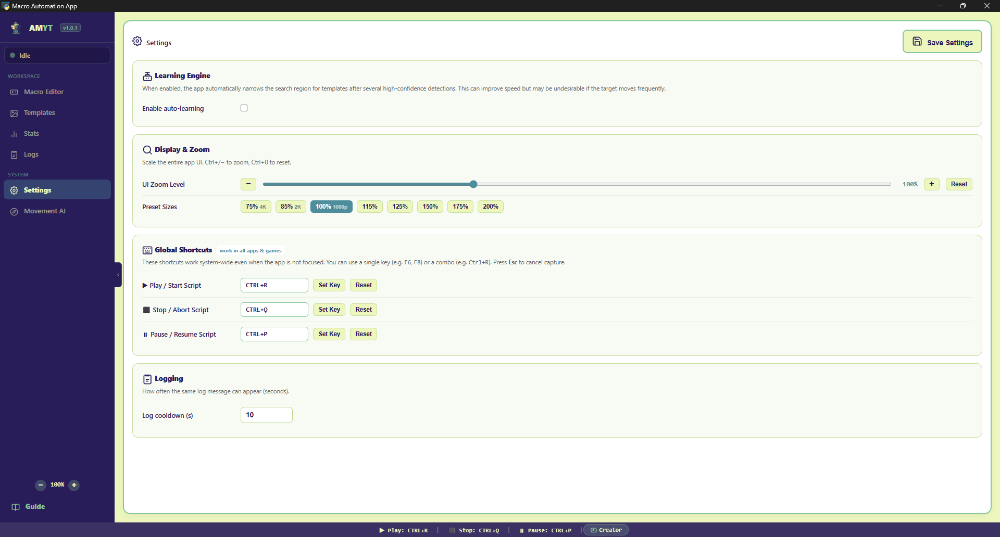
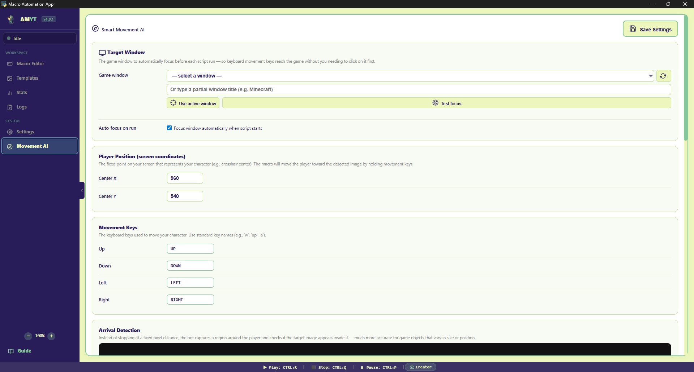

# AMYT — Macro Automation App

<p align="center">
  
</p>

<p align="center">
  
  
  
  
</p>

<p align="center">
  Record, write, and run automation scripts — mouse, keyboard, image detection, OCR, and more.
</p>

---

## Screenshot

<p align="center">
  
</p>

<p align="center">
  
</p>

<p align="center">
  
</p>

<p align="center">
  
</p>

<p align="center">
  
</p>

<p align="center">
  
</p>

<p align="center">
  
</p>
---

## Download

Go to [Releases](https://github.com/kramogs-bug/AMYT-app/releases) and grab the latest `AMYT_vX.X.X_portable.zip`. Unzip and run `AMYT.exe` — no Python needed.

---

## Quick Start

**1. Capture a template**
- Open the **Image Capture** tab
- Name it (e.g. `start_button`) and click **Draw Region on Screen**

**2. Write your script**
```
WAIT 2
CLICK_IMAGE start_button
WAIT_IMAGE_GONE loading 60
TYPE Hello world
PRESS enter
```

**3. Run it**
- Click **▶ Run Script** or press `Ctrl+R`

---

## Features

| | |
|---|---|
| **Script editor** | Syntax highlighting, autocomplete, run from cursor, breakpoint debugger |
| **Image detection** | OpenCV template matching, live detect, multi-scale, rotation support |
| **OCR** | Find and click text on screen with `TEXT_CLICK` and `READ_TEXT` |
| **Color detection** | Match pixel colors with `WAIT_COLOR` and `READ_COLOR` |
| **Navigation AI** | `NAVIGATE_TO_IMAGE` — moves toward a target using keyboard input |
| **Command builder** | Drag-and-drop toolbar, click-to-insert for every command |
| **Script sharing** | Export/import `.amyt` packages with bundled templates |
| **Global hotkeys** | Run, stop, and pause from any window — configurable in Settings |
| **Recording** | Record your actions and replay them as a script |

---

## Common Commands

| Command | Example | What it does |
|---|---|---|
| `WAIT` | `WAIT 2` | Pause for 2 seconds |
| `CLICK` | `CLICK 500 300` | Click at coordinates |
| `TYPE` | `TYPE Hello` | Type text |
| `PRESS` | `PRESS enter` | Press a key |
| `HOTKEY` | `HOTKEY ctrl+c` | Key combination |
| `CLICK_IMAGE` | `CLICK_IMAGE btn` | Find image and click |
| `WAIT_IMAGE` | `WAIT_IMAGE btn 30` | Wait until image appears |
| `IF_IMAGE` | `IF_IMAGE btn` ... `END` | Branch if image visible |
| `LOOP` | `LOOP` ... `END` | Loop forever |
| `REPEAT` | `REPEAT 5` ... `END` | Repeat N times |
| `STOP` | `STOP` | Stop the script |

Full command reference is inside the app — click **Guide** in the sidebar.

---

## Installation (from source)

```bash
git clone https://github.com/kramogs-bug/AMYT-app.git
cd AMYT-app
python -m venv venv
venv\Scripts\activate
pip install -r requirements.txt
python main.py
```

> **OCR support** (optional): `pip install easyocr` or `pip install pytesseract`

---

## Troubleshooting

**Image detection not working** — recapture the template, or lower confidence: `CLICK_IMAGE btn 0.6`

**Keys not reaching the game** — go to **Movement AI → Target Window**, set your game window, click **Use active window**, then Save.

**Blank screen on launch** — run `pip install pywebview --upgrade`

**App closes instantly** — run `python main.py` in a terminal to see the error.

---

## License

MIT — see [LICENSE](LICENSE) for details. Made by [@kramogs-bug](https://github.com/kramogs-bug)
